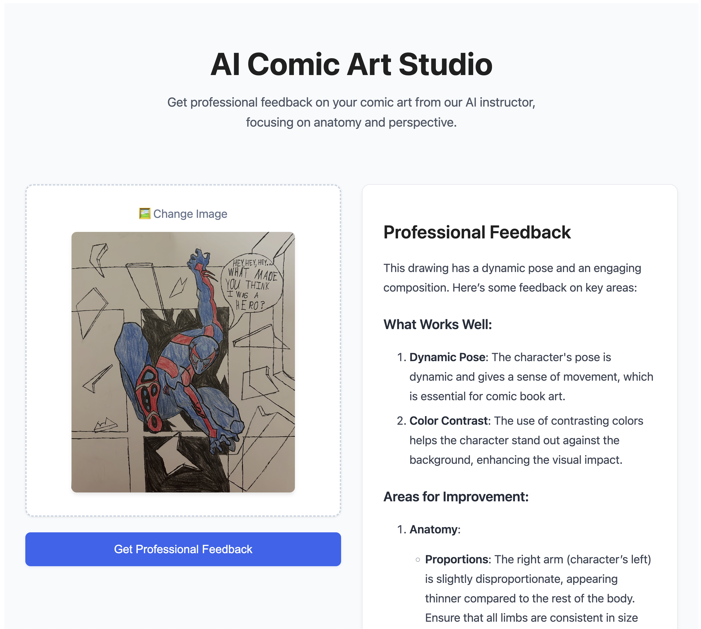

# AI Comic Art Studio

AI Comic Art Studio is an interactive web application that provides professional, detailed feedback on comic art, focusing on anatomy and perspective. Using GPT-4 Vision technology, it analyzes artwork and provides constructive feedback to help artists improve their skills.

## Features

- 🎨 Instant professional art feedback
- 👁️ Advanced anatomy and perspective analysis
- 🚀 Modern, responsive UI with drag-and-drop support
- 📝 Detailed, markdown-formatted feedback
- 💡 Constructive and encouraging suggestions

## Tech Stack

### Frontend
- React
- Vite
- React Markdown

### Backend
- FastAPI
- OpenAI GPT-4 Vision
- Python 3.13+

## Prerequisites

- Node.js and pnpm for frontend
- Python 3.13+ and Conda for backend
- OpenAI API key

## Installation

### Backend Setup

1. Create and activate a Conda environment:
```bash
conda create -n aiartstudio python
conda activate aiartstudio
```

2. Install backend dependencies:
```bash
cd backend
pip install -r requirements.txt
```

3. Set up environment variables:
```bash
# Copy the example environment file
cp .env.example .env

# Edit .env and add your OpenAI API key
# Replace 'your-api-key-here' with your actual OpenAI API key
```

### Frontend Setup

1. Install frontend dependencies:
```bash
cd frontend
pnpm install
```

## Running the Application

1. Start the backend server (in the backend directory):
```bash
conda activate aiartstudio
uvicorn main:app --reload
```
The backend will be available at `http://127.0.0.1:8000`

2. Start the frontend development server (in the frontend directory):
```bash
pnpm dev
```
The frontend will be available at `http://localhost:5173`

## Usage

1. Open your browser and navigate to `http://localhost:5173`
2. Upload your artwork by dragging and dropping or clicking the upload area
3. Click "Get Professional Feedback"
4. Receive detailed feedback about:
   - Anatomy analysis
   - Perspective evaluation
   - Specific areas for improvement
   - Positive aspects of your work

## Example

Here's an example of artwork submitted for feedback in our application:



The application provides detailed feedback on anatomy, perspective, and artistic elements while maintaining an encouraging and constructive tone.

## API Endpoints

### POST /api/feedback
Accepts image uploads and returns professional art feedback.

**Request:**
- Method: POST
- Content-Type: multipart/form-data
- Body: file (image)

**Response:**
```json
{
    "feedback": "Detailed markdown-formatted feedback"
}
```

## Development

The project is structured as follows:
```
aiartstudio/
├── backend/
│   ├── main.py           # FastAPI server
│   ├── llm_client.py     # OpenAI integration
│   └── requirements.txt  # Python dependencies
└── frontend/
    ├── src/
    │   └── main.jsx     # React application
    ├── package.json     # Node.js dependencies
    └── vite.config.js   # Vite configuration
```

## Contributing

1. Fork the repository
2. Create your feature branch (`git checkout -b feature/amazing-feature`)
3. Commit your changes (`git commit -m 'Add amazing feature'`)
4. Push to the branch (`git push origin feature/amazing-feature`)
5. Open a Pull Request

## License

This project is licensed under the MIT License - see the LICENSE file for details.
